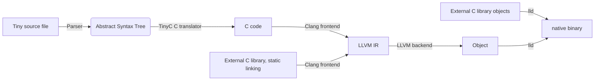

<h2 align="center"> Tiny programming language </h2>

**Tiny** - **tiny** programming language project for **tiny** embbed projects with **tiny** easy-to-learn syntax, **tiny** compiler and **tiny** package manager.

